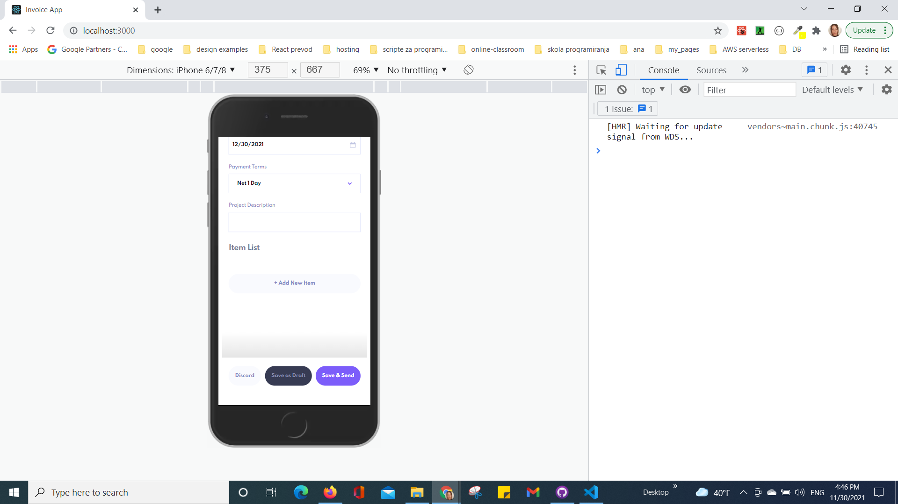

### Expected Behavior

**Have fun building!** 🚀

# Tatjana Marković E commerce React app solution

## Table of contents

  - [Overview](#overview)
  - [The challenge](#the-challenge)
  - [Screenshot](#screenshot)
  - [Links](#links)
  - [My process](#my-process)
  - [Built with](#built-with)
  - [Author](#author)

## Overview

    - Creating an invoice
  - When creating a new invoice, an ID needs to be created. Each ID should be 2 random uppercase letters followed by 4 random numbers.
  - Invoices can be created either as drafts or as pending. Clicking "Save as Draft" should allow the user to leave any form field blank, but should create an ID if one doesn't exist and set the status to "draft". Clicking "Save & Send" should require all forms fields to be filled in, and should set the status to "pending".
  - Changing the Payments Terms field should set the `paymentDue` property based on the `createdAt` date plus the numbers of days set for the payment terms.
  - The `total` should be the sum of all items on the invoice.
- Editing an invoice
  - When saving changes to an invoice, all fields are required when the "Save Changes" button is clicked. If the user clicks "Cancel", any unsaved changes should be reset.
  - If the invoice being edited is a "draft", the status needs to be updated to "pending" when the "Save Changes" button is clicked. All fields are required at this stage.
- Users should be able to mark invoices as paid by clicking the "Mark as Paid" button. This should change the invoice's status to "paid".
- Users should receive a confirmation modal when trying to delete invoices.

### The challenge

Your challenge is to build out this invoicing application using React and get it looking as close to the design as possible.

We provide the data in a local `data.json` file, so use that to populate the content on first load. If you want to take it up a notch, feel free to build this as a full-stack application!

Your users should be able to:

- View the optimal layout for the app depending on their device's screen size
- See hover states for all interactive elements on the page
- Create, read, update, and delete invoices
- Receive form validations when trying to create/edit an invoice
- Save draft invoices, and mark pending invoices as paid
- Filter invoices by status (draft/pending/paid)
- Toggle light and dark mode
- **Bonus**: Keep track of any changes, even after refreshing the browser (`localStorage` could be used for this if you're not building out a full-stack app)

### Screenshot

### Links

- Solution URL: [GitHub](https://github.com/tatjama/zadatak10-invoice-app-react/tree/develop)
- Preview: [Vercel](https://zadatak10-invoice-app-react-6v1hbur1k-tatjana.vercel.app/)
- Live Site URL: [Vercel](https://zadatak10-invoice-app-react.vercel.app/)

## My process

1. Create a new project with [Create React App](https://github.com/facebook/create-react-app).
2. Initializing git repositories main and develop
3. Import git repositories to the Vercel project
4. Create React Components
5. import npm styled component
6. Style for Desktop 
7. Responsive Mobile and Tablet style
8. Create Navigation
9. Create Hooks
10. Manual Test for bugs
11. Create screenshots
12. Change README-template.md to README.md
13. Open Pull request
14. Solve Issue
15. Merge develop branch into master branch
### Built with

1. React.js
2. StyledComponents
3. CSS custom properties
4. localStorage
5. fakeStoreAPI
## Author

- Website - [Tatjana Markovic](https://my-react-portfolio-tatjana.vercel.app/)
- LinkedIn - [Tatjana Marković](https://www.linkedin.com/in/tatjana-markovi%C4%87-919501189/)
- GitHub - [tatjama](https://github.com/tatjama)

